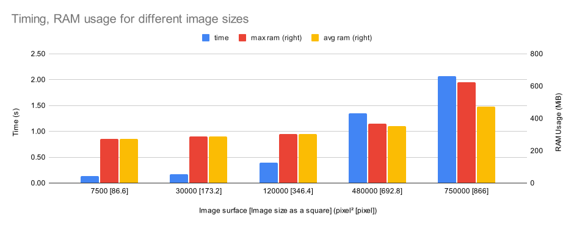
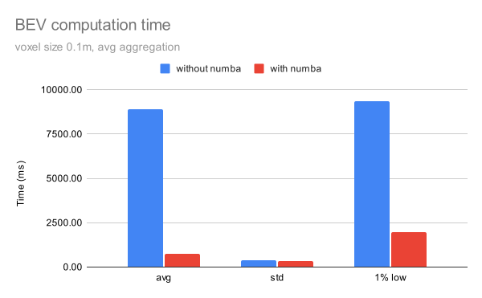
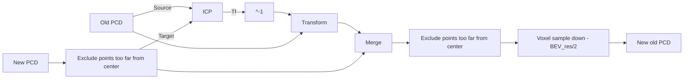
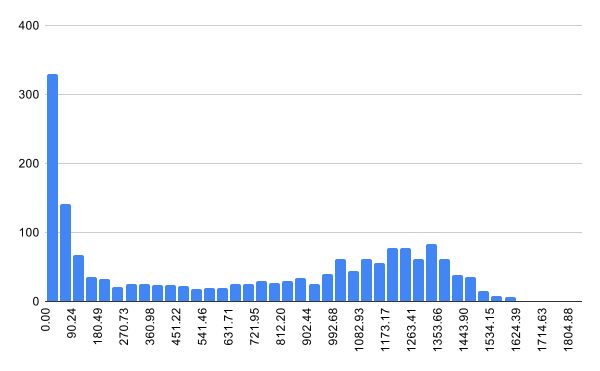
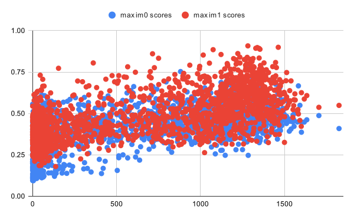
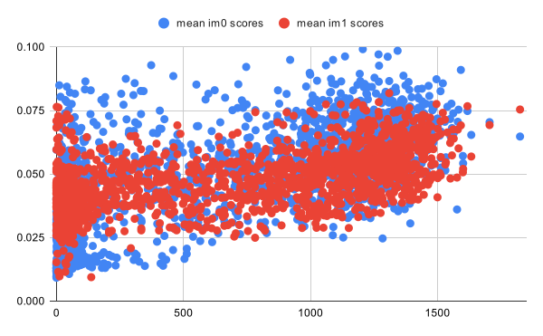
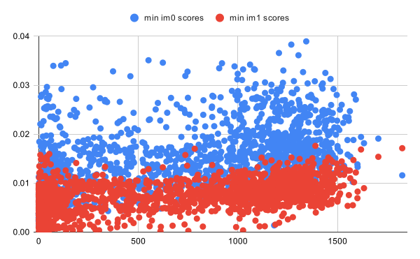

Results of my research and tests
===

## IGN map

| Satellite image                    |
|------------------------------------|
|  |

## Terrain segmentation

### Detectree

| 100px                                                            | 800px                                                            | 1000px                                                             |
|------------------------------------------------------------------|------------------------------------------------------------------|--------------------------------------------------------------------|
|  |  |  |



| Satellite image                    | Satellite image classified                               |
|------------------------------------|----------------------------------------------------------|
|  |  |

## Calibration of the Viewpro Q10F

After some tests, at a given zoom, the calibration noise is bigger than the variation because of the
changes in focal length due to the focus (when adding gaussian noise (avg=0, std=1) on the coordinates
of the detected chessboard, the focal length changes by more than when only changing the focus setting)
Hence, a calibration matrix for each zoom seems reasonable.

[calibration.py](../scripts/utils/calibration.py) is used to perform calibrations and tests. For a zoom = 1, using
Kfold (5 folds) technique to evaluate the reprojection errors, it is close to 10.


At zoom = 1,
```python
k = np.array([[1360, 0, 630], [0, 1360, 344], [0, 0, 1]])
d = np.array([[-1.60867089e-01], [3.00941722e-01],
              [5.51651036e-05], [6.23006522e-03],
              [0.00000000e+00]])
```

## BEV projection

### Using RGB, Depth and camera intrinsic parameters of the ZED

- Replay ROS bag using [rosbag.py](../../scripts/rosutils/rosbag.py).
- Topic of the zed `rgb/image_rect_color`, `depth/depth_registered` and `rgb/camera_info`
- For python implementation open3d doesn't help that much, using numba improve for-loop in bev significantly

| RGB                                                           | Depth                                                     | PCD                                                           |
|---------------------------------------------------------------|-----------------------------------------------------------|---------------------------------------------------------------|
|  |  |  |

| Small square column to do the bev                                     | BEV (f78229f2) 0.1, avg aggregation                               | BEV (75ca91e5) 0.05, avg aggregation                                    |
|-----------------------------------------------------------------------|-------------------------------------------------------------------|-------------------------------------------------------------------------|
|  |  |  |



Accumulating points doesn't really make it better... The computation start at ~ 1Hz and slowly slows down to 0.5Hz (
after 526 iterations) while the accumulated pcd grown from 100k to 450k. Even with the use of ICP, the pcd ends up
having shifts aberration, especially in the trees.

| Accumulated pcd                                                                 | BEV from accumulated pcd (77b3ec64) (0.5)                                                         |
|---------------------------------------------------------------------------------|---------------------------------------------------------------------------------------------------|
|  |  |



### Warping RGB ZED Image

See thesis report.

## UAV/UGV images pairing

### #1 Generating 6x2 grid of patch

I first tried to generate a 6x2 grid of patch in front of the uav and the ugv. The problem with this technic is that
first there is a lot of patch generated ($ \sim 6 \times 10^3$ for uav), the second is that there is even more
possible comparisons ($\mathcal{O}(n^2)$). My idea was to try to find if there was a correlation with the number of
matched points and distance between the position were the image was taken (one by the uav, the other with ugv).
Sadly, it didn't give any meaningful results: the variety of image was too big and the estimation of the distance
between two image was to approximate.

### #2 Test along the trajectory

After the first experiment, I decided to focus and benchmark different techniques for the matching. Using patches
extracted along the path of the robot oriented in the same direction as the one of the robot, I was able to
test Xfeat (with lighterglue, vanilla and star), omniglue and orb.

Using XFeat, it gives pretty promising results :

| UGV/UAV/UGV region in UAV                              | Keypoints matched                                            |
|--------------------------------------------------------|--------------------------------------------------------------|
|  |  |
|  |  |
|  |  |

A (really) small statistic analysis shows that there is a small correlation between the mean/max/min scores (of the
keypoints) and the number of matched keypoints. This means that implementing a strategy when taking picture of
key location that only keeps "good" images is something that can be considered.

| hist of number of matches                                                    | max of keypoints scores depending on the number of matches                         | mean of keypoints scores depending on the number of matches                          | min of keypoints scores depending on the number of matches                         |
|------------------------------------------------------------------------------|------------------------------------------------------------------------------------|--------------------------------------------------------------------------------------|------------------------------------------------------------------------------------|
|  |  |  |  |

Using omniglue gives disappointing results. Even if it, sometimes, is able to find the correct location, it
has a had tendency to generate homography that do not represent something that is physically possible given
the constraints of the problem at hand (e.g. the reprojected image of the ugv in the uav is a crossed quadrilateral,
a quadrilateral where 3 points are close to aligned or an unreasonably small quadrilateral)

| UGV/UAV/UGV region in UAV                                  | Keypoints matched                                                |
|------------------------------------------------------------|------------------------------------------------------------------|
|  |  |

Side note: in order to do the inference, the image were all _resized_ to a 400x400 image. This can impact the results of
the algorithm but given how bad they are, I did not try to go in more details. Also, feasibility under onboard &
realtime constraints is also part of the "scoring" of the different methods.

### #3 0°, 90°, 180°, 270°

After these easy tests, I increased the complexity by adding rotation (multiple of 90°, in order to prevent any
deformation of the pixels at a micro level). This is because in the real experiment, the ugv will not be present
in the image and the orientation of it is _apriori_ unknown, therefore the relative orientation of the uav image
and ugv image is "random" (more of that in the next experiment).

Before re-running the benchmark, I add few indicator that help find obvious bad matches (e.g. the reprojected image of
the ugv in the uav is a crossed quadrilateral, etc.). I also normalised the images before applying the mean square
error (mse) and the structural similarity index measure (ssim) scores.

Sadly it gave pretty bad results, as even xfeat gave poor results when not on the 0° images.

<!-- no image because would need to be regenerated using 4b62d8c6 -->

A good way to see this is to look at the rate of obvious wrong images (see below). It clearly shows that when the angle
is not 0° the number of obvious wrong doubles (or even nearly triples).

| xfeat+ligherglue                                                                                        | xfeat                                                                         | xfeat$^*$                                                                                 | omniglue                                                                            | orb                                                                       |
|---------------------------------------------------------------------------------------------------------|-------------------------------------------------------------------------------|-------------------------------------------------------------------------------------------|-------------------------------------------------------------------------------------|---------------------------------------------------------------------------|
|  |  |  |  |  |

When only looking at the not obvious wrong images, the mse and ssim of the common region in the uav and ugv images
detected by the algorithms. It is important to keep in mind that the scores are really noisy and that the plot should
be used to understand the underlying trend. The first information shown in the plot is the repartition of the mse (lower
is better) and the ssim (higher is better) for each angle (when "mentally" ignoring the x-axis). It confirms that
even among not obvious wrong images when the rotation between images is not 0°, all the different algorithms give
pretty bad result. The second is the correlation with the number of found matches and the improvement in the scores.
These results also confirm that the xfeat+ligherglue algorithm is the best version at finding matches.

| algorithm        | 0°                                                                                        | 90 °                                                                                        | 180 °                                                                                         | 270 °                                                                                         |
|------------------|-------------------------------------------------------------------------------------------|---------------------------------------------------------------------------------------------|-----------------------------------------------------------------------------------------------|-----------------------------------------------------------------------------------------------|
| xfeat+ligherglue |  |  |  |  |
| xfeat            |                            |                            |                            |                            |
| xfeat$^*$        |                |                |                |                |
| omniglue         |                      |                      |                      |                      |
| orb              |                                |                                |                                |                                |

### #4 -10°, -5°, 0, 5°, 10°

In the previous section, it was assumed that there was no knowledge about the relative orientation between the
uav and the ugv image. This is partially wrong, as the robots measure their heading. Therefore, it is theoretically
possible to realign the images. For this new test, the dataset was regenerated in order to have uav images with a
relative angle of -10, -5, 0, 5, 10 degrees and verify that in this case the algorithms would be able to find the
regions. And, as shown in the next graph, it works great with xfeat+ligherglue!

| xfeat+ligherglue                                                                                        | xfeat                                                                         | xfeat$^*$                                                                                 | omniglue                                                                            | orb                                                                       |
|---------------------------------------------------------------------------------------------------------|-------------------------------------------------------------------------------|-------------------------------------------------------------------------------------------|-------------------------------------------------------------------------------------|---------------------------------------------------------------------------|
|  |  |  |  |  |

| algorithm        | -10°                                                                                          | -5 °                                                                                        | 0 °                                                                                       | 5 °                                                                                       | 10 °                                                                                        |
|------------------|-----------------------------------------------------------------------------------------------|---------------------------------------------------------------------------------------------|-------------------------------------------------------------------------------------------|-------------------------------------------------------------------------------------------|---------------------------------------------------------------------------------------------|
| xfeat+ligherglue |  |  |  |  |  |
| xfeat            |                            |                            |                            |                            |                            |
| xfeat$^*$        |                |                |                |                |                |
| omniglue         |                      |                      |                      |                      |                      |

Looking at the timings, it shows that xfeat+ligherglue (and other versions of xfeat) is faster than omniglue

| xfeat+ligherglue                                                                        | xfeat                                                           | xfeat$^*$                                                                   | omniglue                                                              | orb                                                         |
|-----------------------------------------------------------------------------------------|-----------------------------------------------------------------|-----------------------------------------------------------------------------|-----------------------------------------------------------------------|-------------------------------------------------------------|
|  |  |  |  |  |

Seeing those results, confirms that xfeat+lighterglue is a good candidate.

### Simulation of the real algorithm

See thesis report.